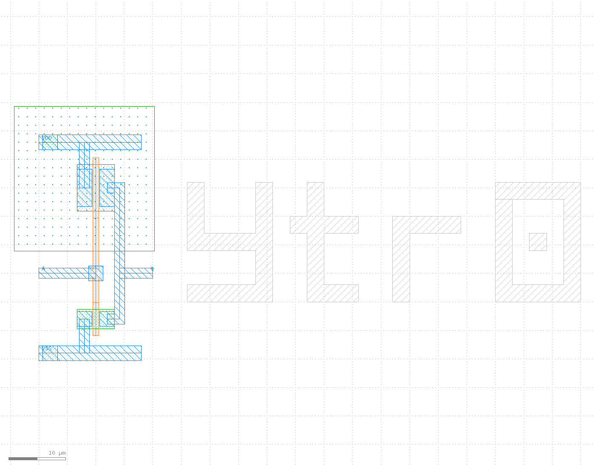
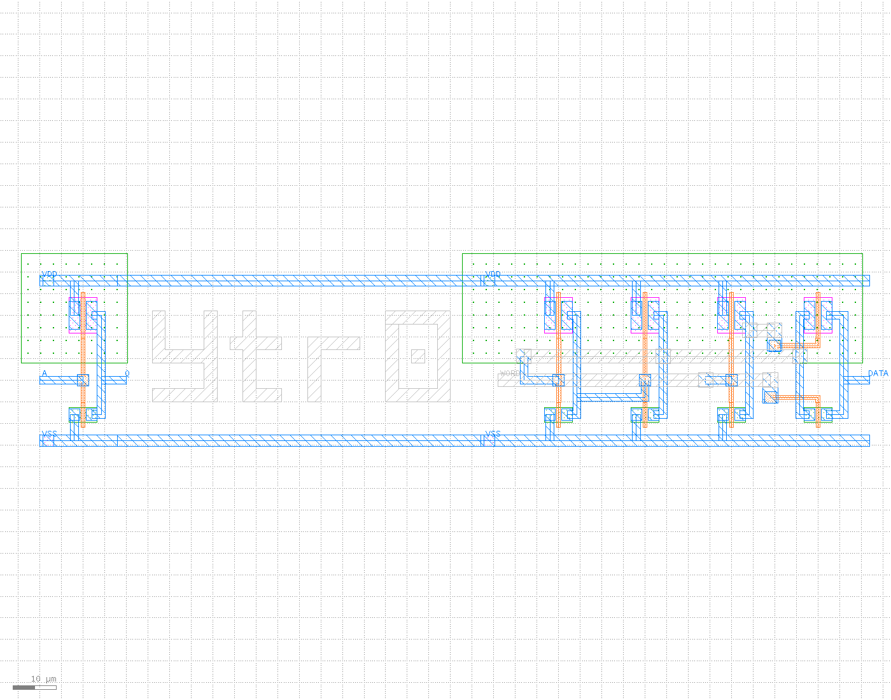
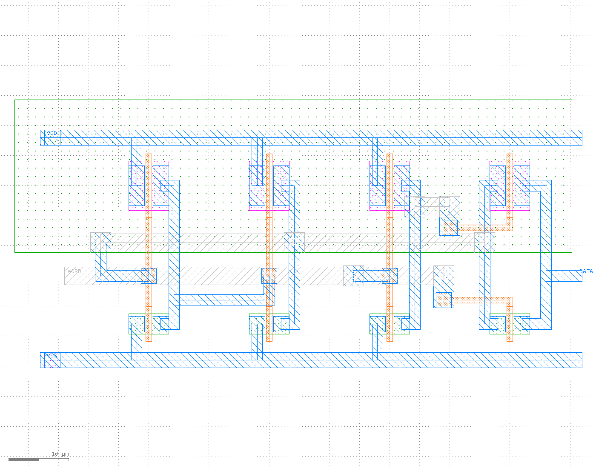

# opensusi-tr10-inverter

OpenSUSI-TR10（TR-1um PDK、1µm CMOS）で作った CMOS インバータ一式です。

回路図は xschem、レイアウトは KLayout で作りました。
DRC と LVS、それにレイアウトから抽出した回路のシミュレーションまで、コマンド1つで通せます。

| 項目 | 値 |
|---|---|
| PDK | [OpenSUSI/TR-1um](https://github.com/OpenSUSI/TR-1um) v1.2609.0 |
| トランジスタ | PMOS W=8.2µm / NMOS W=3.4µm（L=1µm） |
| 大きさ | インバータ 24.6 × 44.6µm / SRAM 94 × 45µm（full 全体で 196 × 45µm） |
| DRC | 違反 0 件 |
| LVS | 一致 |
| SRAM | トランジスタ 8個。書き込み・保持・読み出しを確認済み |
| しきい値 / VOH / VOL | 2.498V / 5.00V / 0.00V（VDD=5V） |
| 遅延 tpHL / tpLH | 0.84ns / 0.70ns（負荷 100fF、27℃） |

PMOS の幅を 8.2µm にしたのには理由があります。
この値だと、しきい値が VDD のちょうど半分になり、
立ち上がりと立ち下がりの速さもそろいます（1.14ns と 1.17ns）。

### inverter_only



左がインバータ、右が M2 で描いた `ytr0` の文字です。

### full（SRAM 付き）



左がインバータ、中央が M2 のアート、右が 1ビットの SRAM です。
上下の太い線が VDD と VSS。この電源の配線はトップのセルにあるので、SRAM を消しても切れません。

### sram_only（SRAM だけを拡大）



左の2列がラッチ、3列目が WORD を反転するインバータ、右端がトランスミッションゲートです。
灰色の横帯は M2 の配線（上が Q のたすきがけ、下が WORD）。小さな四角が M1 と M2 をつなぐ V1 です。

## 渡すファイル

追加パッドをもらえるかどうかで中身が変わるので、複数を用意しました。
**ファイルを差し替えるだけ**で切り替わります。トップセル名はどちらも `ytr0_top` です。
GDS を編集してもらう必要はありません。

| 名前 | 中身 | ピン | 場所 |
|---|---|---|---|
| `inverter_only` | インバータ + アート | A, Q, VDD, VSS | `variants/inverter_only/ytr0_top.gds` |
| `full` | 上記 + 1ビット SRAM | 上記 + DATA, WORD | `variants/full/ytr0_top.gds` |
| `sram_only` | SRAM 単体（検証用） | DATA, WORD, VDD, VSS | `variants/sram_only/ytr0_top.gds` |

いずれも DRC は 0 件、LVS は一致します。
LVS 用のネットリストは、それぞれの `simulation/ytr0_top.spice` に入っています。

## 動かし方

PDK の用意は [ishi-kai/OpenEDA-PDK_SetupScript](https://github.com/ishi-kai/OpenEDA-PDK_SetupScript) を見てください。
`$PDK_ROOT` と `$PDK`（= `TR-1um`）が設定されている前提です。

```sh
./check.sh                 # 全部 レイアウト生成 → DRC → LVS
./check.sh full            # 1つだけ

xschem sim.sch             # 回路図とテストベンチを開く
postlayout/run.sh          # インバータ単体の DRC → LVS → シミュレーション比較
ngspice postlayout/tb_sram.spice       # SRAM の書き込みと読み出しを波形で見る
```

レイアウトを KLayout で開くときは、**かならず `klayout.sh` を使ってください**。
ライブラリを相対パスで読むので、直接起動すると落ちます。

```sh
cd variants/full && klayout.sh -n TR-1um ytr0_top.gds
```

`check.sh` の出力はこうなります。

```
=== full
>> layout    WROTE .../variants/full/ytr0_top.gds
>> DRC       violations: 0
>> LVS       INFO : Congratulations! Netlists match.
```

## SRAM の使い方

インバータを2個たすきがけにしたラッチに、トランスミッションゲートで外からつなぎます。
電源が入っている間は値を保持します。切ると消えます。

| 操作 | DATA | WORD |
|---|---|---|
| 書く | 0V か 5V を駆動する | 5V にする |
| 保持 | 開放 | 0V |
| 読む | 開放にして電圧を測る | 5V にする |

読み出しは非破壊です。ラッチがパッド（10pF 想定）を自分で充電し直すので、
値は壊れません。シミュレーションでは 3V に達するまで 1.1µs、そのあいだ内部の電圧は 3.42V までしか下がりませんでした。

気をつける点です。

- 書き込みは DATA を**強く駆動**してください。弱い駆動だと反転しません
- 読むときは DATA を**必ず開放**にしてください。駆動したままだと書き込みになります
- 電源を切ると内容は消えます。不揮発ではありません
- 電源を入れた直後の値は決まっていません。チップごと、ビットごとに違います（これ自体が「指紋」として使えます）

NMOS のパストランジスタ1個では 1 を書き込めません（しきい値の分だけ電圧が落ちるため）。
このためトランスミッションゲートにして、WORD の反転をチップの中で作っています。

## ファイル

| ファイル | 中身 |
|---|---|
| `ytr0_inverter.sch` | インバータの回路図 |
| `ytr0_sram.sch` | 1ビット SRAM の回路図（トランジスタ 8個） |
| `ytr0_tempsens.sch` | 温度センサの回路図（ΔVbe 方式）。いまはどのバリアントにも入れていない |
| `variants/*/ytr0_top.sch` | トップの回路図（ブロックをならべたもの） |
| `variants/*/ytr0_top.gds` | トップのレイアウト |
| `layout/gen_layout.py` | レイアウトを作るスクリプト（`-rd variant=full`） |
| `check.sh` | 各バリアントの DRC と LVS |
| `sim.sch` | インバータの DC 特性を見るテストベンチ |
| `main.sch` | 新しく設計を始めるときの雛形 |
| `postlayout/run.sh` | インバータ単体の検証（DRC → LVS → シミュレーション比較） |
| `postlayout/tb_sram.spice` | SRAM の書き込み・保持・読み出しを見るテストベンチ |
| `postlayout/tb_tempsens.spice` | 温度センサの温度特性を見るテストベンチ（未使用） |

## SRAM だけ外せる作りになっています

```
ytr0_top
├── ytr0_inverter  (A, Q, VDD, VSS)
├── ytr0_sram      (DATA, WORD, VDD, VSS)   ← full のみ
└── art_ytr0       (M2 のアート、配線なし)
```

- 電源の配線は `ytr0_top` 側にあります。SRAM のセルを消しても、インバータの電源は切れません
- DATA と WORD のラベルは SRAM のセルの中にあるので、セルを消せば一緒に消えます
- とはいえ、`inverter_only` のファイルに差し替えてもらうのが確実です

## この PDK で詰まったところ

同じところで止まる人がいそうなので、書き残しておきます。

**LVS が読む回路図の場所**
KLayout の LVS は、レイアウトと同じフォルダの `simulation/<トップセル名>.spice` を探します。
レイアウトのトップセル名と、回路図の subckt 名をそろえてください。

**LVS 用のネットリスト**
xschem で `lvs_netlist` を有効にして出します。
このとき、シミュレーション用のコードブロック（`.include` や `.control`）には `lvs_ignore=open` を付けて外します。
外さないと、KLayout の SPICE リーダーがパスの解釈でつまずきます。

**ピンになるのはトップセルのラベルだけ**
ブロックのセルの中に置いたラベルは、トップのピンになりません。
トップセルにも同じ名前のラベルを置いてください。

**シリコンアート**
M2 の浮いた図形なら、DRC も LVS も通ります。幅は 3.0µm 以上、間隔は 2.0µm 以上です。
V1 と TXM2 のテキストは使わないでください。配線やピンとして認識されてしまいます。

**パッシベーションの穴はパッドにしか開けられません**（`PO.Z3`）。
可動部のある MEMS は、この標準のフローでは作れません。
