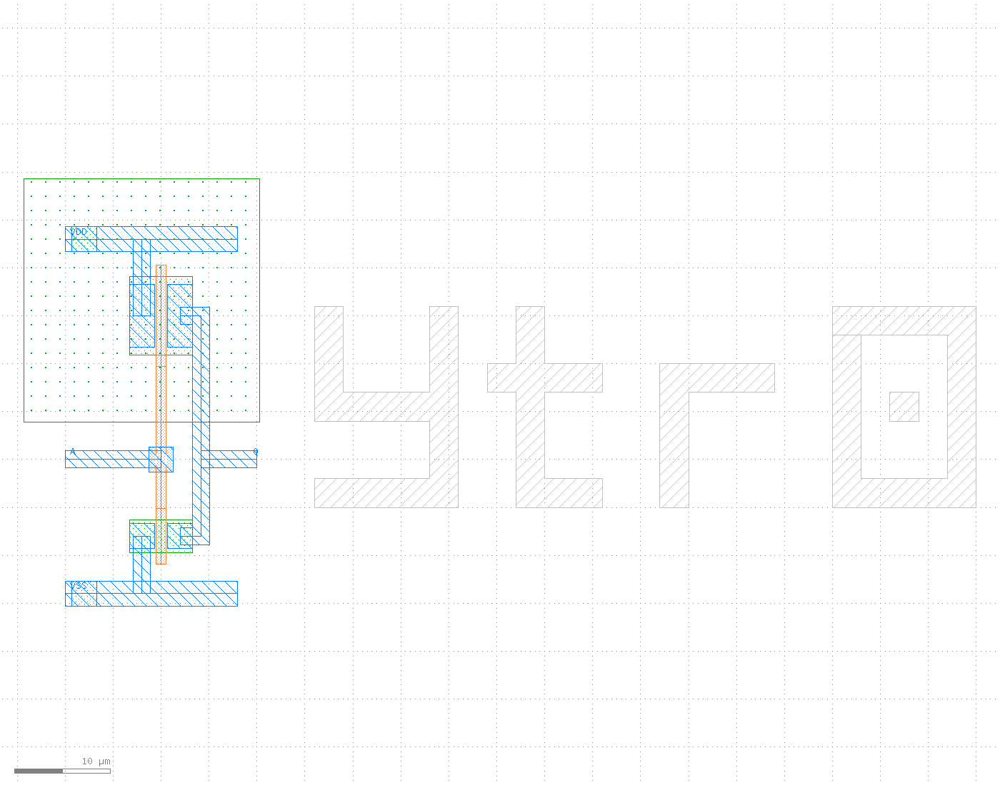

# opensusi-tr10-inverter

OpenSUSI-TR10（TR-1um PDK, 1µm CMOS）で作った CMOS インバータ一式。
回路図（xschem）、レイアウト（KLayout / PCell 生成スクリプト）、DRC・LVS・ポストレイアウト検証を
1 コマンドで回せるようにしてある。

| 項目 | 値 |
|---|---|
| PDK | [OpenSUSI/TR-1um](https://github.com/OpenSUSI/TR-1um) v1.2609.0 |
| デバイス | PMOS W=8.2µm / NMOS W=3.4µm, L=1µm |
| セルサイズ | 24.6 × 44.6µm（シリコンアートを含めて 99 × 45µm） |
| DRC | 違反 0 件 |
| LVS | 一致（Netlists match） |
| Vinv / VOH / VOL | 2.498V / 5.00V / 0.00V（VDD=5V） |
| tpHL / tpLH | 0.84ns / 0.70ns（100fF 負荷、27℃） |

PMOS の W は、しきい値電圧が VDD/2 になり、かつ立ち上がりと立ち下がりが対称（tr 1.14ns / tf 1.17ns）に
なる 8.2µm を選んでいる。



左がインバータ、右が M2 で描いたシリコンアート `ytr0`。

## 構成
| ファイル | 内容 |
|---|---|
| `inverter.sch` | インバータ本体の回路図（LVS の対象） |
| `sim.sch` | インバータの DC 特性を見るテストベンチ |
| `main.sch` | 新規設計用の雛形（モデル読み込み + シミュレーション設定のブロックのみ） |
| `inverter.gds` | レイアウト。トップセル名 `inverter`、シリコンアート `art_ytr0` を含む |
| `postlayout/gen_inverter_layout.py` | レイアウトを生成する KLayout スクリプト（PCell を配置し、N ウェルの寸法はルールから逆算） |
| `postlayout/run.sh` | 単体インバータの DRC → LVS → シミュレーション比較 |
| `layout/gen_layout.py` | バリアント別のレイアウト生成（`-rd variant=full`） |
| `check.sh` | 全バリアントの レイアウト生成 → DRC → LVS |

## 使い方
PDK のセットアップは [ishi-kai/OpenEDA-PDK_SetupScript](https://github.com/ishi-kai/OpenEDA-PDK_SetupScript) を参照。
`$PDK_ROOT` と `$PDK`（= `TR-1um`）が設定されている前提。

```sh
# 回路図・テストベンチ
xschem sim.sch

# レイアウト（KLayout は必ず klayout.sh 経由で、プロジェクトのディレクトリから起動する）
klayout.sh -n TR-1um inverter.gds

# レイアウトを生成し直す
klayout.sh -zz -c ~/.klayout/klayoutrc -rd out=inverter.gds -r postlayout/gen_inverter_layout.py

# DRC → LVS → シミュレーション比較
postlayout/run.sh
```

`run.sh` の出力例:
```
>> 1b. DRC     violations: 0
>> 2.  LVS     INFO : Congratulations! Netlists match.
>> 3.  schematic   Vinv=2.49807e+00  VOH=5.00000e+00  VOL=1.89753e-08
        layout      Vinv=2.49807e+00  VOH=5.00000e+00  VOL=1.89753e-08
```

## バリアント（発注担当に渡すもの）
追加パッドがもらえるかどうかで、**ファイルを差し替えるだけ**で済むように 2 つ用意してある。
トップセル名はどちらも `ytr0_top`。相手が GDS を編集する必要はない。

| バリアント | 内容 | ピン | 場所 |
|---|---|---|---|
| `inverter_only` | インバータ + シリコンアート | A, Q, VDD, VSS | `variants/inverter_only/ytr0_top.gds` |
| `full` | 上記 + 温度センサ | 上記 + TEMP1, TEMP8 | `variants/full/ytr0_top.gds` |

どちらも DRC 違反 0 件、LVS 一致。LVS 用ネットリストは各 `variants/<名前>/simulation/ytr0_top.spice`。

```sh
./check.sh            # 両方を レイアウト生成 -> DRC -> LVS
./check.sh full       # 片方だけ
```

### 温度センサ（ytr0_tempsens）
- DP ダイオード（P+ in N-well）を 9 個一列に並べた ΔVbe 方式。中央 1 個が TEMP1、両側 8 個を並列にして TEMP8。
  1 次元のコモンセントロイド配置で、ウェハ上の勾配の影響を打ち消す。
- N ウェルが共通カソードで、VSS に落としている。**VDD は使わない**。
- 上面は浮いた M2 で覆って遮光してある（パッケージに光が入っても影響しない）。
- 測り方: TEMP1 と TEMP8 に同じ電流（10µA 程度）を流し、電圧差 ΔVbe を読む。25℃ で約 58mV、感度 +0.193mV/℃。
  ダイオード単体の順方向電圧と違い、製造ばらつき（飽和電流が 2 倍ずれても）で値が変わらない。
- 電流源は 1 つを 2 つのピンに切り替えて使うのが確実（別々の電流源だと 1% の差で約 1.3℃ の誤差）。

### 構造（センサだけ消せるようにしてある）
```
ytr0_top
├── ytr0_inverter  (A, Q, VDD, VSS)
├── ytr0_tempsens  (TEMP1, TEMP8, VSS)   ← full のみ
└── art_ytr0       (M2 のアート、配線なし)
```
- 電源レールは `ytr0_top` 側にあるので、`ytr0_tempsens` の配置を消してもインバータの電源は切れない。
- ピンのラベル TEMP1 / TEMP8 はセンサのセルの中にあるので、セルを消せば一緒に消える。
- ただし通常は、`inverter_only` の GDS に差し替えてもらうのが確実。

## この PDK で詰まった点
- **LVS が読む回路図のパス**: KLayout の LVS は、レイアウトファイルと同じディレクトリの
  `simulation/<トップセル名>.spice` を探す。レイアウトのトップセル名は回路図の subckt 名と一致させる。
- **LVS 用のネットリスト**: xschem で `lvs_netlist` を有効にして出力する。シミュレーション用の
  コードブロック（`.include` や `.control`）は `lvs_ignore=open` を付けて除外しないと、
  KLayout の SPICE リーダーがパスの解釈に失敗する。
- **シリコンアート**: M2（幅 3.0µm 以上、間隔 2.0µm 以上）の浮いた図形なら、DRC・LVS ともに影響しない。
  V1 と TXM2 のテキストは使わないこと（配線やピンとして認識されるため）。
- **パッシベーション開口（PO）はパッドにしか開けられない**（`PO.Z3`）。可動部を持つ MEMS 構造は、
  この標準フローでは作れない。

